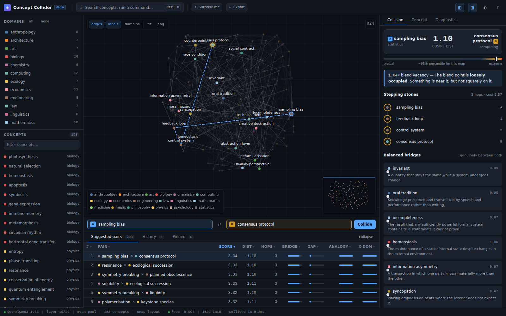

# Concept-mapping-visualization

An open source side project in an attempt to reverse engineer a map of concepts
from LLMs — and to collide distant parts of that map together looking for
connections nobody has made yet.

Extract concept vectors from an open-weight LLM's residual stream (or its SAE
features), correct the geometry so distances actually mean something, find pairs
that are far apart *but still bridgeable*, and explore them in a dependency-free
web front end where any two concepts can be pulled together and collided live.



The build shown is real: Qwen3-1.7B, layer 18 of 28, 153 concepts. See
[docs/FINDINGS.md](docs/FINDINGS.md) for what came out of it.

## Provenance — read this before trusting any number

| artefact | author | reviewed by a human? |
|---|---|---|
| concept definitions | LLM | no |
| structural signatures | LLM | no |
| analogy triplets (`data/probes/`) | LLM | **no** |
| `data/concepts/human_authored.jsonl` | human | n/a |
| code, corrections, measurements | LLM, verified by execution | outputs reproducible |

**Everything except `human_authored.jsonl` was written by a language model.**
An earlier version of this repository described the probe triplets as
"hand-written". They were composed by hand rather than generated
programmatically, but no human wrote or checked them, and calling them
hand-written was misleading. That matters because `probe_accuracy` scores one
model's embeddings against another model's analogy key, over definitions the
same model wrote — it is agreement between two models, not a measurement
against ground truth.

What survives that objection: the anisotropy result (pure geometry, no labels),
the two export bugs (facts about code), and the refuted structural-signature
hypothesis in FINDINGS §5 — contamination would have inflated the loser, not
sunk it. What does not survive it: every accuracy figure, until the labels
carry a human judgement. `web/review.html` exists to fix exactly that.

See [docs/RED_TEAM.md](docs/RED_TEAM.md) for the full adversarial audit.

---

## Quick start

### Just open the GUI

A real build is committed under `web/data`, so the interface works straight
after a clone — **no GPU, no model download, and no dependencies at all**:

```bash
git clone https://github.com/markcwbox-creator/Concept-mapping-visualization.git
cd Concept-mapping-visualization
python3 -m http.server 8000 --directory web
```

Then open <http://127.0.0.1:8000> in any browser.

`python -m collider serve` does the same thing with nicer defaults once you have
the package on your path (`PYTHONPATH=src`), and needs only numpy.

> **It must be served over HTTP.** Double-clicking `web/index.html` will show a
> blank page: the app uses ES modules and `fetch`, and browsers block both on
> `file://` URLs. Any static server will do — `python3 -m http.server`,
> `npx serve web`, VS Code's Live Server, or a real web host.

### Build your own

```bash
pip install -r requirements.txt

# Measure the layer first rather than guessing:
python -m collider sweep --config configs/qwen3-1.7b-4bit.yaml --limit 300
python -m collider all   --config configs/qwen3-1.7b-4bit.yaml

# No GPU? This runs Qwen3-1.7B at fp32 on CPU (~4 min for the seed list):
python -m collider all --config configs/qwen3-1.7b-cpu.yaml
```

Collide two concepts without leaving the terminal:

```bash
python -m collider collide --a photosynthesis --b monetary-policy
```

### On 4 GB of VRAM

`configs/qwen3-1.7b-4bit.yaml` loads Qwen3-1.7B in 4-bit NF4 and fits
comfortably. Two details do most of that work: the extractor captures
activations with a **forward hook** rather than `output_hidden_states=True`
(which would materialise every layer at once), and it loads `AutoModel` rather
than `AutoModelForCausalLM`, since the LM head is dead weight when you never
sample. Roughly 10k concepts in 20-30 minutes.

### Splitting across Colab

Extraction is the only expensive stage:

```bash
# on Colab, with a bigger GPU
python -m collider extract --config configs/llama31-8b-sae.yaml
# copy data/build/vectors.npy + vectors.meta.json back, then locally:
python -m collider build --config configs/llama31-8b-sae.yaml
```

`build` is pure CPU and takes seconds, so you can iterate on pairing weights,
layout and the front end dozens of times per extraction.

---

## What it does

**Concepts are short definitions, not tokens.** Single tokens fragment under
BPE and average over senses; `photosynthesis: The process by which plants
convert light energy...` pins down what you mean and gives the model something
to condition on.

**The geometry gets corrected before anything is measured.** Raw LLM activations
are anisotropic — random unrelated concepts sit at cosine 0.7-0.95, so
"distance" carries almost no signal. Centring plus all-but-the-top removal
takes the real Qwen3-1.7B build from mean cosine **0.838 → −0.007** while
*widening* the spread from 0.027 to 0.070. Before correction, every pair of
concepts sat between 0.76 and 0.92 similarity — nothing was far from anything.
Every build prints this before/after, because if it doesn't happen the map is
decoration. See [docs/DESIGN.md §4](docs/DESIGN.md).

**"Distant" is not the same as "interesting".** The most distant pairs are the
most incoherent ones. Pairs are scored on distance *near a target percentile*,
bridgeability through the kNN graph (unreachable pairs are filtered outright),
separation between the two domains' centroids, midpoint sparsity measured over
every concept *except the pair itself*, and neighbourhood-structure similarity —
with per-domain and per-concept diversity caps. Every pair carries its feature
breakdown so you can re-weight after seeing results.

Three of those five once contributed nothing measurable — one of them because
of an outright bug, and none of them visibly, since a degenerate feature and a
working one produce the same plausible ranked list. What that cost and how it
was found is in [docs/DESIGN.md §5](docs/DESIGN.md); the build now fails if any
of the five collapses again.

**A collision answers four different questions.**

| view | question |
|---|---|
| Stepping stones | the cheapest real chain between them — nothing invented |
| Balanced bridges | what sits genuinely *between*, not merely near one side |
| Nearest the blend | what is closest to the midpoint vector, and how vacant that spot is |
| Orthogonal | far from both poles and sideways to the tension between them |

A **blend vacancy above 1** means nothing in your map names that blend — a
description without a word. Read it comparatively, not as a threshold: at 153
concepts **58% of all pairs clear 1.0**, because the whole space is sparse at
this size. The number starts discriminating when the concept list does.

**The front end is a real application, with no dependencies.** No build step, no
CDN, no framework — ES modules, Canvas 2-D and about 570 lines of CSS over a
token-based design system. It has a command palette (`⌘K`), a virtualised
concept navigator that behaves the same at 150 or 150,000 concepts, resizable
panels, a sortable data grid over every scoring feature, live diagnostics
charts, light/dark themes, pinning with notes that survive reload, JSON/CSV/PNG
export, and full keyboard control.

Layout is precomputed in Python (a browser force simulation lands somewhere
different every reload, destroying spatial memory), but projected int8 vectors
ship to the client, so *any* pair collides live — typically in under 6 ms —
with no server.

---

## Layout

```
src/collider/
  schema.py            Concept / ConceptSet / VectorSet — the artifact contract
  config.py            one flat config; committed in configs/, copied into graph.json
  encoders/
    base.py            Encoder protocol + prompt templates and pooling spans
    hf_residual.py     residual-stream extraction (hooks, 4-bit, template averaging)
    sae.py             SAE features — the interpretable swap-in
    sentence.py        MiniLM baseline / control
  space.py             centring, all-but-the-top, whitening, isotropy diagnostics
  neighbors.py         exact / FAISS / Annoy kNN, Dijkstra over the kNN graph
  pairs.py             distant-but-interesting pair sampling
  bridges.py           the four bridge views
  layout.py            UMAP / PCA / t-SNE, with graceful fallback
  export.py            graph.json + quantised vector blob
  sweep.py             layer & pooling selection by measurement
  pipeline.py          stage orchestration
  __main__.py          CLI: sweep | extract | build | all | collide | serve

web/
  index.html           application shell
  styles/tokens.css    design tokens; light/dark live here and nowhere else
  styles/app.css       shell, panels, components
  js/store.js          observable state + localStorage persistence
  js/data.js           payload loading and validation
  js/collide.js        collision maths (parity-tested against bridges.py)
  js/main.js           wiring, keyboard shortcuts, collisions
  js/ui/mapview.js     canvas map: LOD, minimap, focus mode, PNG export
  js/ui/navigator.js   domain filters + virtualised concept list
  js/ui/inspector.js   collision / concept / diagnostics panels
  js/ui/dock.js        sortable grids: pairs, history, pinned
  js/ui/palette.js     command palette with subsequence matching
  js/ui/charts.js      inline SVG charts
  js/ui/shell.js       toasts, modals, splitters, status bar, theme
data/concepts/         seed_concepts.jsonl (153 concepts, 18 domains)
data/probes/           analogy triplets for evaluation (see Provenance)
configs/               qwen3-1.7b-4bit · qwen3-1.7b-cpu · llama31-8b-sae · minilm-cpu
docs/DESIGN.md         the arguments, and where this is most likely wrong
docs/FINDINGS.md       measurements from the first real build
docs/COLAB.md          splitting extraction onto a cloud GPU
tests/                 29 tests, including Python↔JavaScript parity
```

---

## Growing the concept list

The seed list is 153 concepts across 18 domains — enough to demonstrate the
mechanism, not enough to find anything. To reach 1k-10k, the honest options are
WordNet synsets with glosses (~120k, lexical and heavily nominal) or Wikidata
descriptions (millions, entity-heavy and full of proper nouns that are not
really concepts).

Watch for the seam: definitions from different sources share stylistic
structure that shows up as similarity. If source predicts distance, that is a
bug to fix, not a discovery. Curation is the substance here, not a chore to
automate away.

---

## Tests

```bash
PYTHONPATH=src:tests python -m pytest tests/ -q
```

Tests run on a randomly-initialised toy model built offline, so the whole suite
runs on CPU in seconds with no downloads. They target the failure modes that are
*silent* — padding leaking into pooled vectors, isotropy correction not
correcting, kNN ordering, and the Python and JavaScript collision maths drifting
apart.

## Status

Beta. The pipeline, the geometry corrections, the pair scoring and the front end
all work, are tested, and have been run end-to-end on a real model.

Two things are worth knowing before you read anything into a map:

1. **153 concepts is too few.** Top-neighbour similarities sit only two to four
   standard deviations above random, so many "bridges" are the least arbitrary
   of several arbitrary options. More concepts will help far more than a bigger
   model — see [docs/FINDINGS.md §3](docs/FINDINGS.md).
2. **Nothing here shows the pairs are generative for a human.** That is the
   load-bearing unknown, and no amount of engineering settles it. The pin-and-note
   workflow exists to collect that evidence.

## Licence

Apache 2.0.
